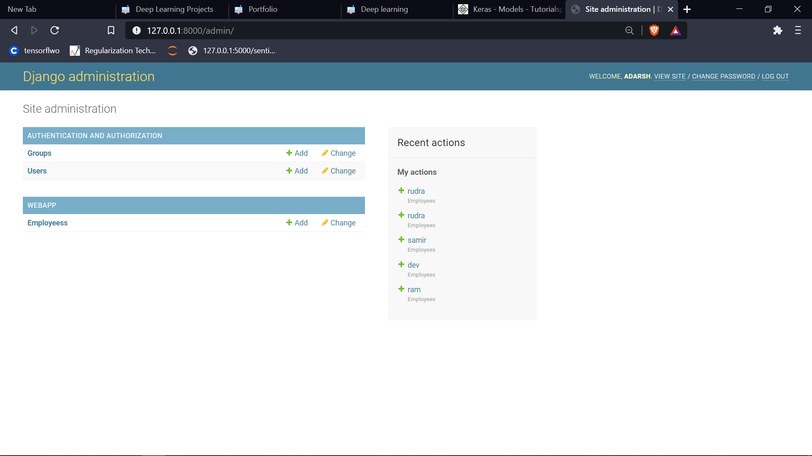

# Simple Django Hello World Starter Template

## Usage

 1. Run `cd myproject/` to change to `myproject/`
 2. Run `python manage.py runserver` to start development server
 3. Navigate to [http://127.0.0.1:8000](http://127.0.0.1:8000) to test

<h1>Results</h1>

